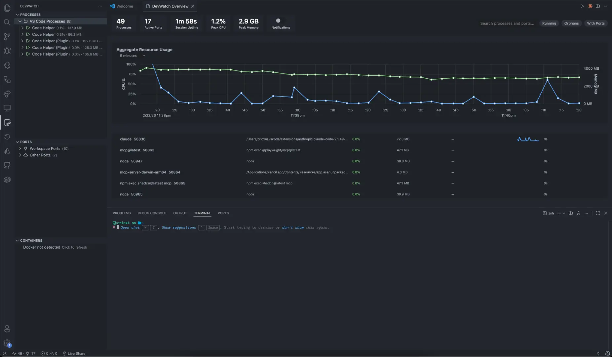

# DevWatch

Real-time process and port management for VS Code, Cursor, VSCodium, and Windsurf.



## Features

- **Process Tree View**: Monitor workspace processes with CPU/memory usage, status indicators, and parent-child relationships
- **Port Scanning**: Bidirectional port-to-process mapping with protocol detection and custom labeling
- **Smart Actions**: Kill, force kill, tree kill, and restart processes with auto-escalation and bulk operations
- **Orphan Detection**: Identify and clean up orphaned processes left behind by terminated parents
- **Resource Alerts**: Configurable CPU and memory thresholds with sustained breach detection
- **Crash Detection**: Distinguish process crashes from user-initiated kills
- **History Logging**: Searchable event timeline with resource snapshots and session summaries
- **Docker Support**: Manage containers and Compose projects directly from the sidebar
- **Claude Code Integration**: MCP server exposes DevWatch tools to Claude for AI-powered process management
- **Public API**: Extension interface for third-party integrations
- **Cross-Platform**: Full support for macOS, Linux, and Windows

## Installation

1. Install from VS Code Marketplace or Open VSX Registry
2. Search for "DevWatch" in the Extensions view
3. Click Install

## Quick Start

1. Open the DevWatch activity bar icon (server process icon)
2. Browse processes and ports in the sidebar
3. Right-click any process to kill, restart, or view history
4. Use `Cmd+Shift+K` (macOS) or `Ctrl+Shift+K` (Windows/Linux) for quick kill
5. Press `Cmd+Shift+H` to open the history panel

## Configuration

| Setting | Default | Description |
|---------|---------|-------------|
| `devwatch.pollingPreset` | `normal` | Polling interval: fast (1s/10s), normal (3s/30s), battery (10s/60s), custom |
| `devwatch.alertThresholdCpu` | `80` | CPU usage threshold (%) for alerts |
| `devwatch.alertThresholdMemoryMB` | `500` | Memory usage threshold (MB) for alerts |
| `devwatch.notificationVerbosity` | `minimal` | Notification level: minimal (crashes + critical), moderate (+orphans +conflicts), comprehensive (+new ports) |
| `devwatch.showInfraProcesses` | `false` | Show infrastructure processes (shells, VS Code helpers) |
| `devwatch.skipKillConfirmation` | `false` | Skip confirmation dialogs for force-kill and kill-tree |
| `devwatch.historyRetentionDays` | `14` | Number of days to retain history logs |
| `devwatch.sessionSummary.enabled` | `true` | Show session summary on close if anomalies detected |
| `devwatch.mcp.enabled` | `false` | Enable MCP server integration for Claude Code |
| `devwatch.docker.enabled` | `true` | Enable Docker container monitoring |

## Claude Code Integration

DevWatch includes an MCP (Model Context Protocol) server that exposes process management tools to Claude Code and other AI assistants.

### Setup

1. Enable MCP integration:
   ```json
   {
     "devwatch.mcp.enabled": true
   }
   ```

2. The MCP server provides these tools to Claude:
   - `list_processes`: List workspace processes with PID, name, CPU, memory
   - `kill_process`: Kill a process by PID (graceful with auto-escalation)
   - `check_port`: Check if a port is in use and show the owning process
   - `cleanup_orphans`: Find and kill orphaned processes

3. Claude can now manage processes via natural language:
   - "List all running processes"
   - "Kill the process using port 3000"
   - "Clean up orphaned processes"

### Example Workflows

**Port conflict resolution:**
> "Port 8080 is in use. Show me what's using it and kill it."

Claude will use `check_port` to identify the PID, then `kill_process` to free it.

**Orphan cleanup:**
> "Clean up any orphaned processes in my workspace."

Claude will use `cleanup_orphans` to find and terminate orphaned processes.

## Requirements

- **VS Code**: 1.96.0 or higher
- **Docker** (optional): For container management features

## Keyboard Shortcuts

- `Cmd+Shift+K` / `Ctrl+Shift+K`: Quick Kill Process
- `Cmd+Shift+R` / `Ctrl+Shift+R`: Restart Last Killed Process
- `Cmd+Shift+H` / `Ctrl+Shift+H`: Open History Panel

## Platform Support

| Platform | Process Discovery | Port Scanning | Workspace Detection | Kill Operations |
|----------|------------------|---------------|---------------------|-----------------|
| macOS | ps, lsof | lsof | lsof -F | kill, SIGTERM/SIGKILL |
| Linux | ps | ss, netstat | /proc/{pid}/cwd | kill, SIGTERM/SIGKILL |
| Windows | tasklist | Get-NetTCPConnection | Process tree only | taskkill /F |

## Contributing

Issues and pull requests are welcome on [GitHub](https://github.com/criox4/DevWatch).

## License

MIT - See [LICENSE](LICENSE) for details.
